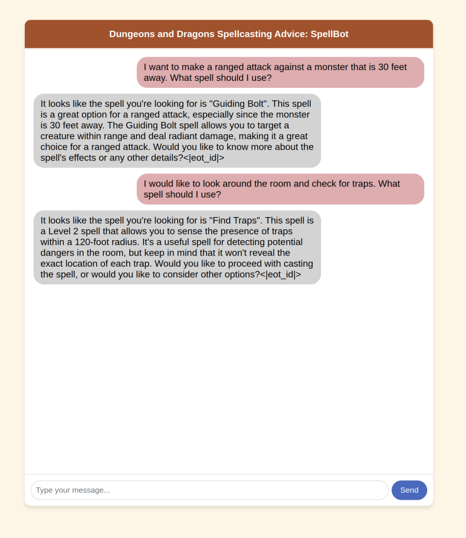

# DnD_Chatbot
A simple chatbot that uses retrieval augmented generation to give me personalized spellcasting advice for my Dungeons and Dragons character. 

[DND](banner.jpeg.jpg)
## Step 1: Set up environment
Create a conda enviroment from the requirements.txt file with the following command:
```
conda install --file requirements.txt
```

## Step 2: Download LLaMA model locally
By setting up the LLM locally, we do not have to use an API key to generate completions. Use the bash script to get a small model and launch the server locally. The server will be accessible on your computer at [http://127.0.0.1:8080/](url). 
```
bash SetupLLM_locally.sh
```

## Step 3: Launch UI and interact with SpellBot
Launch the model and UI with the following code:
```
python RunSpellBot.py
```
The UI will be designed according to index.html and will be accessible locally at [http://127.0.0.1:5000](url)! 
The code will use the `SpellsTable.csv` to supplement it's responses (using Retrieval Augmented Generation). 

Typically, you will get a response in 10 seconds. 

See example conversation below!

